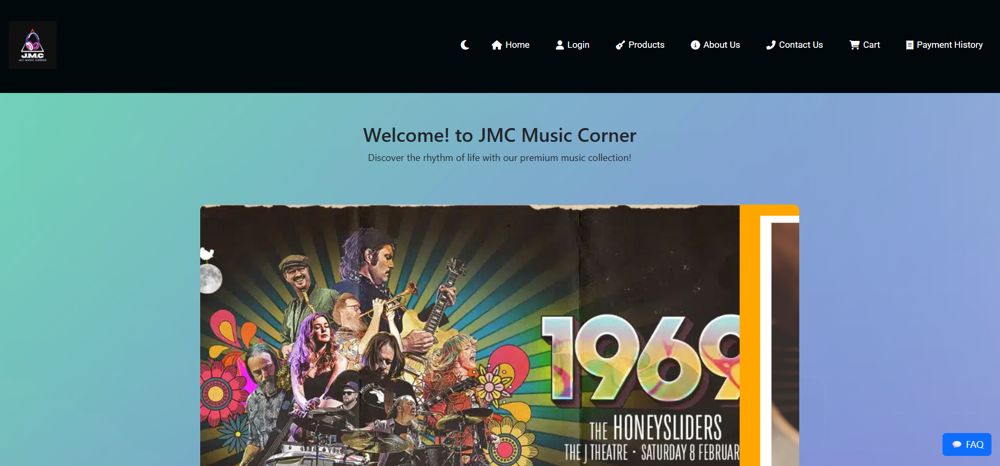
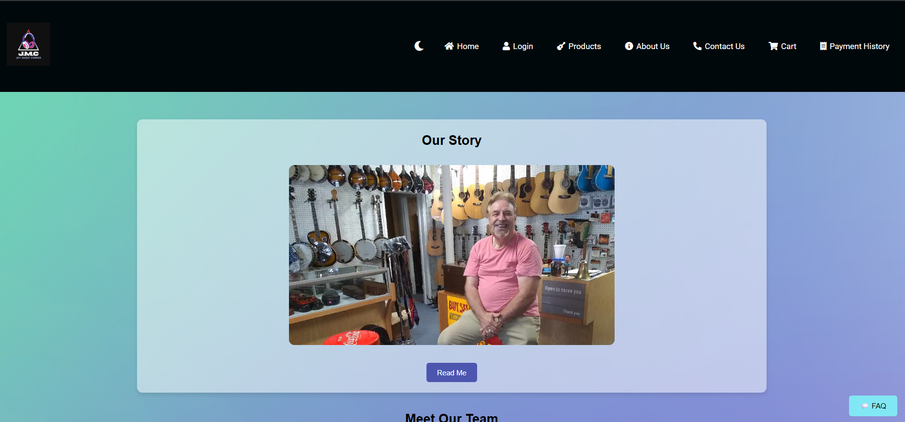
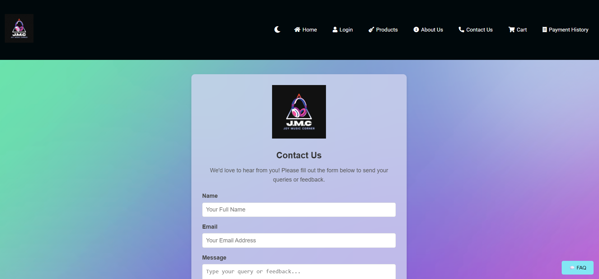
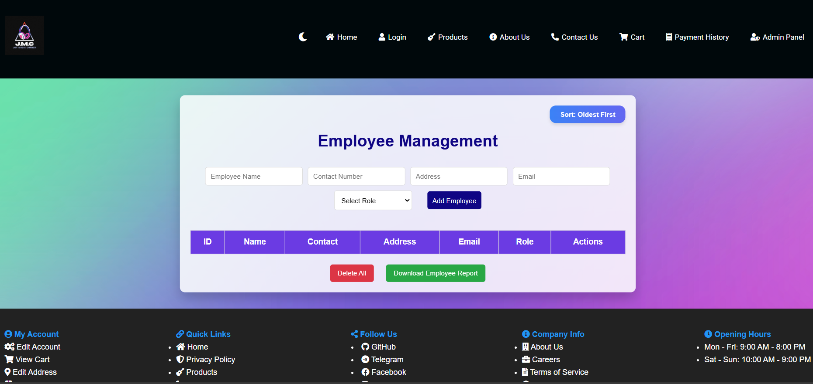

# 🎵 JMC Music Shop

<p align="center">
  
  
  
  
  
  
  
  
  
  <br />
  <br />
  <strong>Developed by:</strong> Shalini Archana Vidanaarachchi  
  <br />
  A full-stack eCommerce platform for musical instruments and music-related gadgets.
</p>


## 🌟 Overview

JMC Music Shop is a comprehensive, user-friendly online store where users can shop for instruments, earphones, headsets, and more. The platform supports user accounts, cart management, order tracking, product reviews, and an admin panel for smooth operations.


## 🛒 Key Features

### 👤 User Side
- 🔐 User sign up & login system  
- 🛍️ Browse products and add to cart  
- 🧾 Place and track orders  
- ⭐ Rate and review products  
- 📜 View purchase history

### 🛠️ Admin Panel
- 📊 Manage products, deliveries and users  
- 👥 Employee management  
- 🧾 Generate sales and delivery reports  
- 🛠️ User management & access control


## 💻 Tech Stack

| Layer        | Technologies                                      |
|--------------|-------------------------------------------------|
| **Frontend** | HTML, CSS, Bootstrap, JavaScript, AJAX          |
| **Backend**  | Node.js, PHP, REST APIs                          |
| **Database** | MySQL                                           |
| **Others**   | Session management, Admin authorization, APIs   |


## 📸 Screenshots

<p align="center">
  
  
  
  
  <br />
  
  
  
 
</p>
🚀 Getting Started

1️⃣ Clone the repository
Copy
Edit
git clone https://github.com/shaliniarchana/JMC-Music.git
cd JMC-Music

2️⃣ Setup Local Server

Place the project folder inside your PHP server directory (e.g., C:\wamp64\www\)
Import the provided SQL database dump to your MySQL database
Start your local server (WAMP/XAMPP)

3️⃣ Run the application
Open in browser:
Copy
Edit
http://localhost/JMC-Music/HOMEPAGE.php


🤝 Contributing

Contributions are welcome!
Feel free to submit bug reports, feature requests, or pull requests.

📜 License
MIT License © Shalini Archana Vidanaarachchi

📬 Contact
Made with ❤️ by Shalini Archana Vidanaarachchi

<p align="center"> <a href="https://github.com/shaliniarchana" target="_blank" rel="noopener noreferrer">  </a> <a href="https://www.linkedin.com/in/shaliniarchana/" target="_blank" rel="noopener noreferrer">  </a> <a href="mailto:shalini.archana@example.com" target="_blank" rel="noopener noreferrer">  </a> </p> ```
